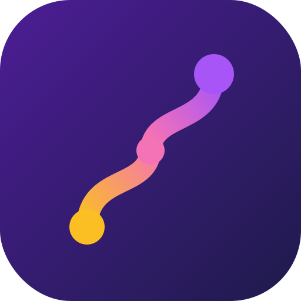

<p align="center">
  
</p>

<h1 align="center">Brain Trails</h1>

<p align="center">
  <strong>A gamified study companion with an RPG soul.</strong><br/>
  Focus timers · Flashcards · Trials · AI tutoring · Cosmetics · A subject-centric Codex
</p>

<p align="center">
  
  
  
</p>

---

## Project Activity

<p align="center">
  
</p>

## Tech Stack

**Frontend & Design**


**Backend, Data & AI**


**State & Architecture**


---

## Features

| Module | What it does | Status |
|--------|--------------|--------|
| **Dashboard** | Adventurer's board home with character card, daily quest log, activity feed, and a leaderboard with a Realm/Circle toggle | Live |
| **Codex** | Subject-centric study hub — every subject owns its topics, decks, notes, trials, and exam-cram, with a mastery ring and exam countdown | Live |
| **Focus** | Calm, theme-aware Pomodoro with growth animation, ambient soundscapes (rain/cafe/lofi/...), and XP/gold rewards | Live |
| **Notebook** | Notion-style rich-text editor (Tiptap) with slash commands, callouts, `.docx` import, and autosave | Live |
| **Decks** | Flashcard decks with flip animation, shuffle, and SM-2 spaced repetition (due-first ordering) | Live |
| **Trials** | "Trial by Fire" quiz engine with timed questions, AI generation, and a shareable result card | Live |
| **Exam Cram** | Per-subject distraction-free crunch session, launched from the Codex | Live |
| **AI Familiar** | Study assistant powered by Google Gemini — summarize, quiz, explain, and parse syllabi | Live |
| **Circle** | Friends system — add by username, accept requests, live online presence, and Mana Boosts (+XP) | Live |
| **Cosmetics Shop** | Spend in-game gold on themes, avatar frames, titles, and backgrounds across four rarity tiers | Live |
| **Achievements** | 50+ unlockable badges across study, social, streak, and exploration categories | Live |
| **Ambient Player** | Embedded Spotify player plus synthesized ambient soundscapes (no audio assets) | Live |
| **The Grand Archive** | Animated "about" experience with a cinematic intro and lore pages | Live |
| **Weekly Report** | Analytics — focus time, XP, streak, a 365-day study heatmap, and a shareable stats card | Live |
| **Onboarding** | One-line subject entry (AI scaffolds topics) or syllabus upload / manual setup | Live |
| **Traveler Hotbar** | Floating navigation menu with quick access to every screen | Live |
| **Sun / Moon Theme** | Full light/dark mode with animated sky backgrounds and persistence | Live |

> Some early concepts (Guild Hall, Battle Arena, Knowledge Map) live on as off-nav routes while the core notebook -> test -> flex loop is kept tight. They may return once polished.

---

## Getting Started

### Prerequisites

- **Node.js 20+**
- **Python 3.12+** (for the AI backend only)
- A **Supabase** project

### 1. Clone & install

```bash
git clone https://github.com/Musteab/Brain-Trails.git
cd Brain-Trails/brain-trails
npm install
```

### 2. Environment variables

Create `brain-trails/.env.local`:

```env
NEXT_PUBLIC_SUPABASE_URL=your_supabase_project_url
NEXT_PUBLIC_SUPABASE_ANON_KEY=your_supabase_anon_key
NEXT_PUBLIC_AI_API_URL=your_ai_backend_url   # optional, defaults to localhost:5000
```

### 3. Database setup

Open the **Supabase SQL Editor** and run the contents of:

```bash
brain-trails/supabase/schema.sql
```

This creates the core tables, RLS policies, and triggers. The incremental
migrations under `brain-trails/supabase/migrations/` add later features (SM-2
scheduling, social/friends, storage buckets) - apply any that aren't already
reflected in your database.

### 4. Run the frontend

```bash
npm run dev
```

Open [http://localhost:3000](http://localhost:3000).

### 5. Run the AI backend (optional)

```bash
cd backend
python -m venv venv
venv\Scripts\activate        # Windows
# source venv/bin/activate   # macOS/Linux
pip install -r requirements.txt

echo GEMINI_API_KEY=your_key_here > .env
python app.py
```

Backend runs on [http://localhost:5000](http://localhost:5000).

---

## Project Structure

```plaintext
brain-trails/
├── app/                  # Next.js App Router pages
│   ├── codex/            # Subject hub
│   │   └── [id]/         # Per-subject view + exam-cram
│   ├── circle/           # Friends / Circle
│   ├── focus/            # Focus (Pomodoro + ambient)
│   ├── notes/            # Notebook (rich-text editor)
│   ├── flashcards/       # Decks (SM-2)
│   ├── quiz/             # Trials
│   ├── report/           # Weekly report + heatmap
│   └── shop/             # Cosmetics merchant
├── backend/              # Flask + Gemini AI server
├── components/           # Modular React components
│   ├── dashboard/        # Dashboard widgets (memoized)
│   ├── focus/            # Focus timer components
│   ├── notes/            # Editor, AI Familiar, extensions
│   ├── report/           # StreakCalendar and report UI
│   └── ui/               # Hover cards, reusable UI
├── context/              # AuthContext, ThemeContext
├── hooks/                # Custom hooks (useFriends, useQuests, ...)
├── lib/                  # Utilities and Supabase clients
├── public/               # Static assets, icons
├── stores/               # Zustand state management
└── supabase/             # schema.sql + migrations
```
*(Abridged for readability)*

---

## Testing

```bash
npm run lint                    # Linting
npm run build                   # Production build (includes TS checks)
cd backend && pytest tests/ -v  # Backend tests
```

---

## Design Philosophy

- **"Nintendo meets Notion"** — playful RPG theming with a clean, functional UI.
- **Premium glassmorphism** — frosted glass cards with subtle borders and backdrop blur.
- **Animated backgrounds** — parallax moon/sun skies with particles, clouds, and stars.
- **Rarity-tiered cosmetics** — Common to Legendary, with escalating visual effects.
- **Zustand over Redux** — lightweight stores, no boilerplate.
- **Web Audio over audio files** — oscillator synthesis for UI sounds, zero `.mp3` assets.
- **Supabase over a custom backend** — auth, database, and realtime in one. Flask is AI-only.

---

## Contributing

Want to help make Brain Trails better? Pull requests are welcome.

- **Find a task:** check the Issues tab for bugs or feature requests, and comment to claim one.
- **Gear up:** fork the repo, clone it locally, and set up your `.env` (see Getting Started).
- **Write the code:** create a branch (`git checkout -b feature/your-feature`), and match the existing "Nintendo meets Notion" style.
- **Submit for review:** push your branch and open a Pull Request - include screenshots for UI changes.

*Please ensure your code passes `npm run build` and `npm run lint` before submitting.*

---

## License

Distributed under the **MIT License**.

<br />
<p align="center">
<em>"Every quest completed brings you closer to mastery." — Archie</em>
</p>
