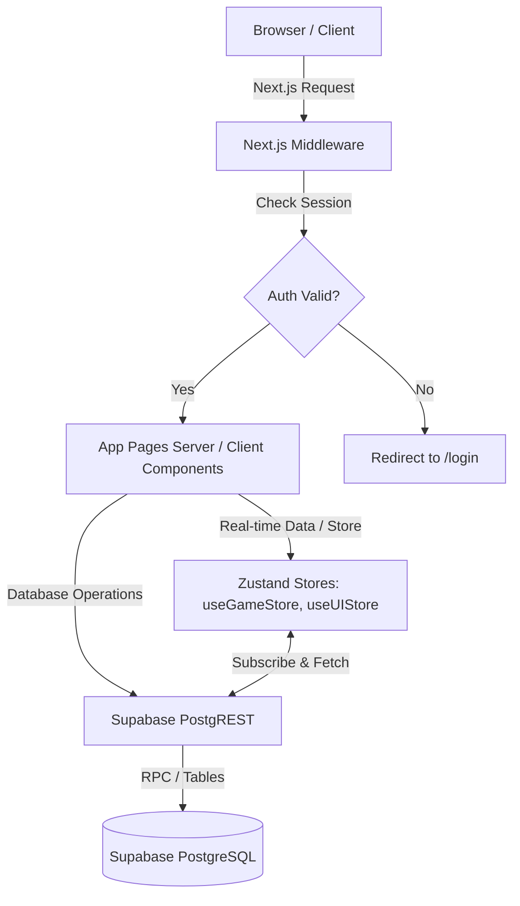

# Architecture

## Simple Flow Diagram

## Component Architecture

- **Next.js App Router**: Handles routing, SSR, layout nesting (`app/`).
- **Middleware (`middleware.ts`)**: Server-side session validation. Intercepts all requests to ensure only authenticated users hit the dashboard.
- **Supabase Auth**: JWT-based authentication storing tokens in HTTP-only cookies (via `@supabase/ssr`).
- **Zustand**: Client-side state management for ephemeral UI states (modals, toasts) and cached game stats (XP, level) that need optimistic updates.
- **Framer Motion**: Handles all client-side animations, page transitions, and interactive UI micro-interactions.
