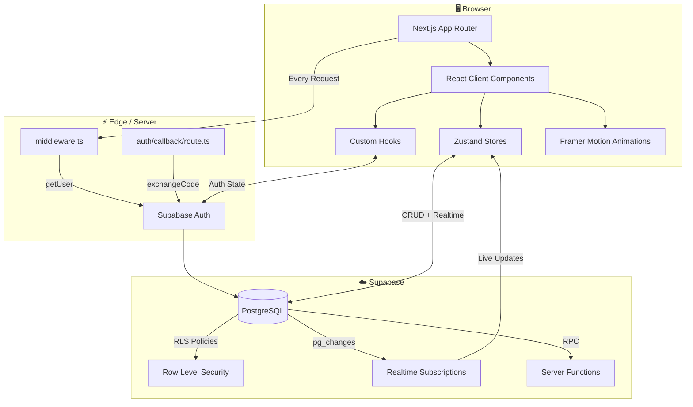
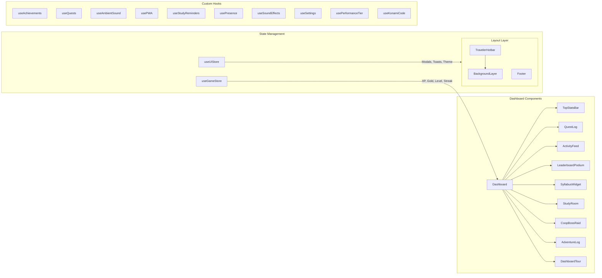
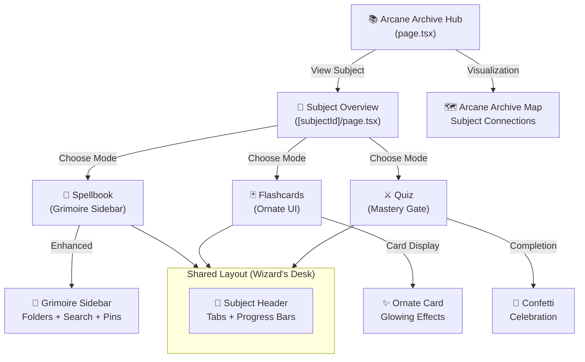

# Architecture

## System Overview



## App Router Structure

```
app/
├── (auth)
│   ├── login/           → Email + Google sign-in
│   ├── register/        → Account creation with username
│   ├── forgot-password/ → Password recovery request
│   ├── reset-password/  → New password form
│   ├── confirm-email/   → "Check your inbox" screen
│   ├── email-confirmed/ → Success landing page
│   └── auth/callback/   → OAuth + email code exchange (server route)
│
├── (dashboard)
│   ├── page.tsx          → Main dashboard (TopStatsBar, QuestLog, ActivityFeed, etc.)
│   └── focus/            → Pomodoro focus timer with ambient sounds
│
├── arcane-archive/       → Subject-centric learning hub ✨ NEW
│   ├── page.tsx          → Archive hub showing all subjects
│   └── [subjectId]/
│       ├── layout.tsx    → Wizard's Desk shared layout
│       ├── page.tsx      → Subject overview
│       ├── spellbook/    → Subject-specific notes with Grimoire Sidebar
│       ├── flashcards/   → Subject-specific flashcards with ornate UI
│       └── quiz/         → Subject-specific quizzes with mastery gate
│
├── (features)
│   ├── flashcards/       → Spaced repetition flashcard decks (legacy)
│   ├── quiz/             → Auto-generated quizzes from syllabus (legacy)
│   ├── notes/            → Rich text note editor with persistence (legacy)
│   ├── knowledge/        → AI Syllabus parser — upload PDFs, generate topics
│   ├── battle/           → Co-op Boss Raid system
│   ├── guild/            → Join/create guilds, group leaderboards
│   ├── shop/             → Cosmetics store (titles, frames, backgrounds)
│   ├── achievements/     → Trophy case with rarity tiers
│   └── report/           → Study analytics and progress reports
│
├── (meta)
│   ├── settings/         → User preferences, theme, sound, password
│   ├── about/            → Interactive MagicBook "About" page
│   ├── onboarding/       → First-time user walkthrough
│   ├── admin/            → Admin dashboard (role-gated)
│   ├── privacy/          → Privacy policy (public)
│   ├── terms/            → Terms of service (public)
│   └── support/          → Help and feedback
│
├── robots.ts             → SEO crawl rules
├── sitemap.ts            → Dynamic sitemap generation
└── loading.tsx           → Global loading skeleton
```

## Component Architecture



## Arcane Archive Architecture ✨

The **Arcane Archive** is a subject-centric learning hub that organizes all study materials (notes, flashcards, quizzes) by subject.

### Route Structure
```
/arcane-archive                    Hub showing all subjects
├── /arcane-archive/[subjectId]    Subject overview & study mode selector
│   ├── /spellbook                 Subject-specific notes editor
│   ├── /flashcards                Subject-specific flashcard practice
│   └── /quiz                       Subject-specific quiz with mastery gate
```

### Component Hierarchy


### New Components Added

| Component | Location | Purpose |
|-----------|----------|---------|
| **GrimoireSidebar** | `components/notes/` | Enhanced note sidebar with folders, search, pins |
| **ArcaneArchiveMap** | `components/arcane-archive/` | Canvas-based subject connection visualization |
| **ConfettiCelebration** | `components/quiz/` | Performance-based confetti effects |

## Key Technology Choices

| Layer | Technology | Purpose |
|-------|-----------|---------|
| Framework | Next.js 16 (App Router) | SSR, routing, middleware |
| Styling | Tailwind CSS v4 | Utility-first CSS with `@theme inline` |
| Animations | Framer Motion | Physics-based UI animations |
| State | Zustand | Selective re-renders for game stats |
| Auth | Supabase Auth + `@supabase/ssr` | JWT cookies, OAuth, PKCE |
| Database | Supabase PostgreSQL | RLS, Realtime, RPCs |
| Sound | Howler.js | Ambient music + sound effects |
| PWA | Service Worker + Manifest | Installable, offline-capable |
| Icons | Lucide React | Consistent icon system |
| Fonts | Nunito + Quicksand | Playful headings + clean body text |
