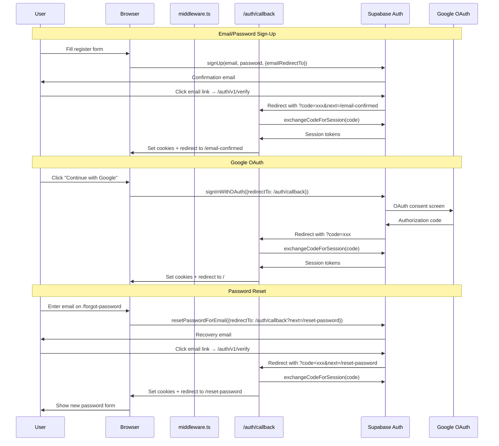

# Authentication Flow

Brain Trails uses Supabase Auth with `@supabase/ssr` for SSR-compatible, cookie-based authentication with PKCE security.

## Flow Diagram

## Three Pillars of Auth

### 1. Middleware (`middleware.ts`)
- Runs on **every request** (except static assets, `/api`, `/auth`, images)
- Creates a Supabase server client using `getAll/setAll` cookie pattern
- Calls `supabase.auth.getUser()` to validate the JWT server-side
- Unauthenticated users on protected routes → redirect to `/login`
- Authenticated users on `/login` or `/register` → redirect to `/`
- **Public pages** (whitelisted): `/login`, `/register`, `/forgot-password`, `/reset-password`, `/confirm-email`, `/email-confirmed`, `/privacy`, `/terms`, `/auth/*`

### 2. Auth Context (`context/AuthContext.tsx`)
- Wraps the entire app via `<AuthProvider>` in `layout.tsx`
- Listens to `onAuthStateChange` for login/logout events across tabs
- Listens to `visibilitychange` to re-validate with `getUser()` when a tab wakes from sleep
- Fetches user profile from `profiles` table; creates a fallback if none exists (e.g., first Google login)
- Exposes: `user`, `session`, `profile`, `signUp()`, `signIn()`, `signInWithGoogle()`, `signOut()`

### 3. OAuth Callback (`app/auth/callback/route.ts`)
- Server-side GET route that handles the code exchange for all flows
- Supports a `?next=` query parameter to redirect to different pages per flow:
  - OAuth login → `/` (dashboard)
  - Email confirmation → `/email-confirmed`
  - Password reset → `/reset-password`
- Dual-writes cookies to both `cookieStore` and `response.cookies` for maximum reliability
- If no `?code=` is present (hash-fragment flow), falls through to the target page

## Security Decisions

| Decision | Reasoning |
|----------|-----------|
| **Cookies over LocalStorage** | Middleware runs on Edge; can't read `localStorage`. Cookies ensure the first HTML response is already authenticated. |
| **`getUser()` over `getSession()`** | `getUser()` validates the JWT with Supabase's server. `getSession()` only decodes the local cookie and can't detect banned/deleted users. |
| **PKCE flow** | Default in `@supabase/ssr` v0.5+. Prevents authorization code interception attacks by requiring a code verifier cookie. |
| **Dual-write cookies** | The callback writes to both `cookieStore.set()` (native Next.js) and `response.cookies.set()` (redirect fallback) because Next.js has quirks with dropped cookies on 307 redirects. |