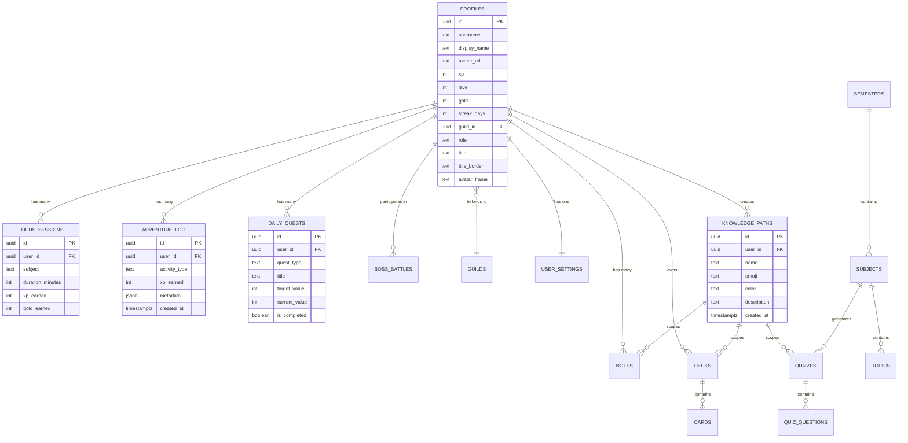

# Database Schema

Brain Trails uses PostgreSQL hosted on Supabase with 14 migrations defining the schema.

## Entity Relationship Diagram



## Tables by Domain

### 🎮 Core Profile
| Table | Purpose | Key Columns |
|-------|---------|-------------|
| `profiles` | Central user hub, 1:1 with `auth.users` | `xp`, `level`, `gold`, `streak_days`, `guild_id`, `role`, `title`, `avatar_frame` |
| `user_settings` | User preferences (theme, sounds, notifications) | `theme`, `ambient_volume`, `sfx_enabled`, `study_reminder_time` |

### 📚 Study System
| Table | Purpose | Key Columns |
|-------|---------|-------------|
| `focus_sessions` | Pomodoro session logs | `subject`, `duration_minutes`, `xp_earned`, `gold_earned` |
| `notes` | Rich text notes with persistence | `user_id`, `title`, `content`, `subject_id` ✨ |
| `decks` | Flashcard deck containers | `user_id`, `title`, `subject_id` ✨ |
| `cards` | Individual flashcards in a deck | `deck_id`, `front`, `back`, `difficulty` |
| `quizzes` | Auto-generated quizzes | `subject_id` ✨, `title`, `question_count` |
| `quiz_questions` | Questions within a quiz | `quiz_id`, `question`, `options`, `correct_answer` |

### 🗺️ Syllabus & Knowledge
| Table | Purpose | Key Columns |
|-------|---------|-------------|
| `knowledge_paths` | Subject-centric learning hubs ✨ NEW | `user_id`, `name`, `emoji`, `color`, `description` |
| `semesters` | Top-level academic term (legacy) | `name`, `user_id` |
| `subjects` | Courses within a semester (legacy) | `semester_id`, `name`, `color` |
| `topics` | Individual topics within a subject (legacy) | `subject_id`, `name`, `is_completed` |

### ⚔️ Game Systems
| Table | Purpose | Key Columns |
|-------|---------|-------------|
| `daily_quests` | Daily/weekly/monthly objectives | `quest_type`, `target_value`, `current_value`, `is_completed` |
| `adventure_log` | Activity feed / event history | `activity_type`, `xp_earned`, `metadata` |
| `boss_battles` | Co-op Boss Raid encounters | `boss_name`, `hp`, `participants` |

## Security

- **RLS (Row Level Security)**: All tables enforce `auth.uid() = user_id` for writes. Public data (leaderboards, guilds) allows broader SELECT access.
- **Triggers**: `handle_new_user()` auto-creates `profiles` + `user_settings` rows on signup.
- **RPCs (Atomic Operations)**:
  - `increment_xp(amount, user_id)` — Atomically updates XP and recalculates level
  - `increment_gold(amount, user_id)` — Atomically updates gold balance
  - Prevents race conditions from concurrent requests (e.g., two quests completing simultaneously)

## Migration History

| # | File | What it does |
|---|------|-------------|
| 01 | `create_profiles` | Core profiles table |
| 02 | `create_focus_sessions` | Pomodoro logging |
| 03 | `create_notes` | Note persistence |
| 04 | `create_decks_and_cards` | Flashcard system |
| 05 | `create_boss_battles` | Co-op raids |
| 06 | `create_adventure_log` | Activity feed |
| 07 | `create_user_settings` | Preferences |
| 08 | `create_triggers_and_functions` | Auto-profile creation |
| 09 | `create_study_subjects` | Full syllabus hierarchy |
| 10 | `enhance_notes` | Rich note features |
| 11 | `create_quizzes` | Quiz system |
| 12 | `create_quests` | Daily quests |
| 13 | `final_polish` | Cosmetics, achievements, guilds |
| 14 | `atomic_increments` | Race-safe XP/gold RPCs |
| 15 | `add_subject_linking` ✨ NEW | Arcane Archive subject-centric structure: adds `subject_id` FK to notes, decks, quizzes + creates `knowledge_paths` table |

## Subject-Centric Architecture ✨

### Knowledge Paths (New)

The `knowledge_paths` table is the anchor for the **Arcane Archive** — a subject-centric learning hub.

```sql
CREATE TABLE knowledge_paths (
    id uuid PRIMARY KEY,
    user_id uuid NOT NULL REFERENCES profiles(id),
    name text NOT NULL,           -- e.g., "Biology", "Spanish"
    emoji text,                   -- e.g., "📚", "🔬", "🌍"
    color text,                   -- e.g., "from-purple-500 to-indigo-600"
    description text,
    created_at timestamptz DEFAULT NOW()
);
```

### Subject Scoping

All study materials now link to a `knowledge_path`:

- **Notes**: `notes.subject_id` → `knowledge_paths.id`
- **Flashcard Decks**: `decks.subject_id` → `knowledge_paths.id`
- **Quizzes**: `quizzes.subject_id` → `knowledge_paths.id`

This enables:
1. **Organized Learning**: All materials for a subject in one place
2. **Progress Tracking**: Per-subject mastery metrics
3. **Mastery Gating**: Quiz unlock requires ≥30% notes + ≥40% card mastery
4. **Visual Connections**: Arcane Archive Map shows subject relationships

### Backward Compatibility

Existing notes, decks, and quizzes have `subject_id = NULL` until explicitly migrated or newly created. Legacy routes (`/notes`, `/flashcards`, `/quiz`) continue to work.
