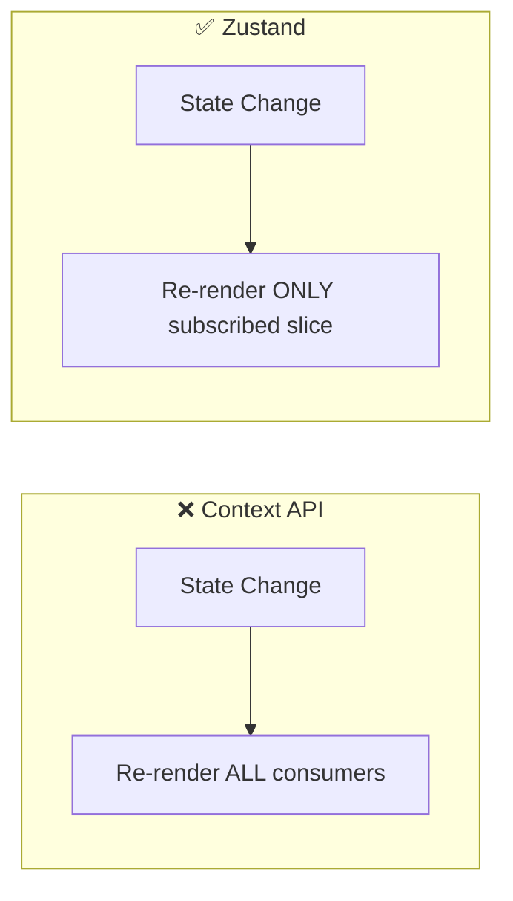

# Technical Decisions

Key architectural choices made during the development of Brain Trails, with rationale.

## Framework & Rendering

### Why Next.js App Router?
- **Server Components by default** — minimizes JS bundle sent to browser
- **Nested layouts** — persistent UI elements (TravelerHotbar, Footer) without re-mounting
- **Built-in middleware** — server-side auth checks on every request
- **Decision**: Pages are Server Components unless they need interactivity (`onClick`, `useState`, Framer Motion), in which case they get `"use client"`.

### Why Tailwind CSS v4?
- Eliminates `tailwind.config.js` — configuration lives in CSS via `@theme inline`
- Zero-runtime CSS — no JavaScript overhead for styling
- Utility-first approach matches the rapid iteration needed for a gamified UI

### Why Framer Motion?
- Physics-based spring animations for UI elements (floating stats, page transitions)
- `AnimatePresence` for exit animations (toast notifications, modal dismissals)
- `motion.div` wrappers for declarative animation — cleaner than CSS keyframes for complex sequences
- Layout animations for smooth reordering (leaderboard position changes)

## State Management

### Why Zustand over Context API?

- **Context API** re-renders every consumer on any state change
- **Zustand** allows selector-based subscriptions: `useGameStore(s => s.xp)` only re-renders when XP changes
- **Decision**: Context for infrequent global state (Auth, Theme). Zustand for rapidly changing game state (XP, gold, level, quests, UI modals).

| Store | Purpose | Update Frequency |
|-------|---------|-----------------|
| `useGameStore` | XP, gold, level, streak, profile | Every study action |
| `useUIStore` | Modals, toasts, sidebar state | Every interaction |
| `AuthContext` | User session, profile | Login/logout only |
| `ThemeContext` | Sun/Moon theme toggle | Rare |

## Backend

### Why Supabase?
- **PostgreSQL + RLS** — row-level security without a custom API layer
- **Realtime** — `pg_changes` subscriptions power the Activity Feed and live leaderboard
- **Auth** — handles OAuth, PKCE, email confirmation, password reset with minimal code
- **Edge Functions** — serverless compute if needed (not currently used)
- **Eliminates a custom backend** — no Express/Fastify server to maintain

### Why Cookies over LocalStorage?
- Next.js middleware runs on the Edge — it cannot access `window.localStorage`
- Cookies ensure the **first HTML payload** is already authenticated
- Prevents the "flash of login screen" on page refresh
- Supabase's `@supabase/ssr` handles cookie serialization automatically

### Why `getUser()` over `getSession()`?
- `getSession()` only decodes the local cookie — doesn't verify with Supabase's server
- `getUser()` sends a request to validate the JWT — catches banned/deleted users
- **Decision**: Use `getUser()` in middleware (security-critical) and `visibilitychange` handler. Use `getSession()` only for quick, non-critical session reads.

### Why Atomic RPCs for XP/Gold?
- Standard `UPDATE SET xp = xp + amount` can race when two actions complete simultaneously
- Supabase RPCs (`increment_xp`, `increment_gold`) execute atomically on the database
- Ensures consistent state without optimistic locking or retry logic

## UX & Performance

### Why Performance Tiers?
- `usePerformanceTier` detects device capability (CPU cores, memory, GPU)
- Automatically reduces animation complexity on low-end devices
- Three tiers: `high` (full animations), `medium` (reduced particles), `low` (no animations)

### Why PWA?
- Users on mobile can install the app to their home screen
- Service worker caches static assets for faster subsequent loads
- Push notification support for study reminders (via `useStudyReminders`)

### Why Ambient Sound?
- Studies show background music improves focus and study retention
- `useAmbientSound` hook manages Howler.js instances with crossfade support
- Volume persisted in `user_settings` table

### Why a Konami Code Easter Egg?
- `useKonamiCode` hook listens for ↑↑↓↓←→←→BA
- Unlocks a hidden developer mode or special cosmetic
- Because every game should have one 🎮
