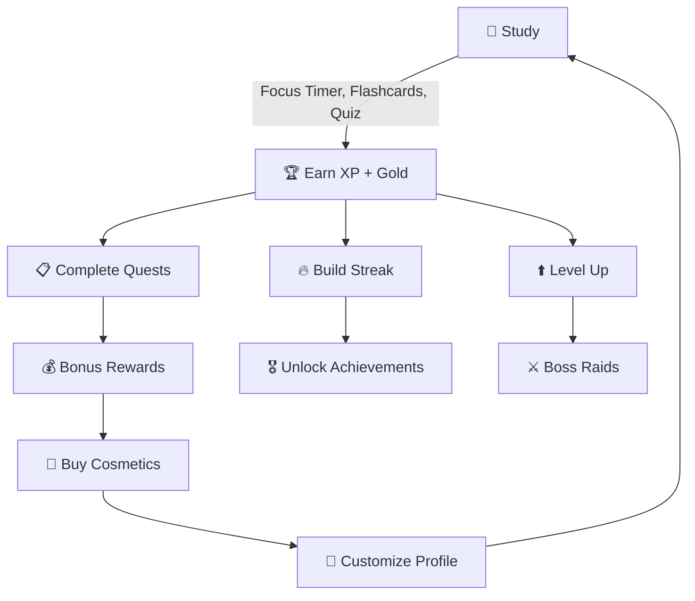
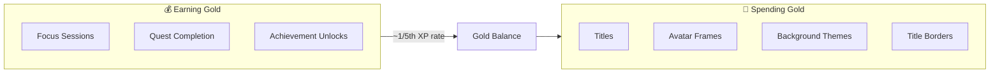

# Game System

The core loop of Brain Trails turns studying into a cohesive RPG experience with XP, levels, gold, quests, streaks, achievements, cosmetics, guilds, and co-op boss raids.

## Core Game Loop

## XP & Leveling

| Action | XP Reward |
|--------|-----------|
| Complete a focus session | +50 XP |
| Review a flashcard | +10 XP |
| Complete a quiz | +25 XP |
| Complete a daily quest | +100 XP |
| Complete a weekly quest | +250 XP |

- **Level Formula**: `Math.floor(xp / 1000) + 1` — Every 1,000 XP = 1 Level
- **Why linear?** Players never feel "stuck" in exponential level grinds. The math is trivial for both UI and DB to calculate independently.
- **Atomic Updates**: XP increments use server-side RPCs (`increment_xp`) to prevent race conditions from concurrent quest completions.

## Gold Economy

- Gold is earned alongside XP at roughly 1/5th to 1/10th the rate
- Spent exclusively in the **Shop** (`/shop`) on cosmetics
- Atomic server-side increments via `increment_gold` RPC

## Streaks 🔥

- Increments when a user completes a meaningful action (focus session, quest) on a **new calendar day**
- A missed day resets the streak to 0
- Visible in the `TopStatsBar` on the dashboard
- Triggers achievement unlocks at milestones (7-day, 30-day, 100-day)

## Quests 📋

| Type | Duration | Reward |
|------|----------|--------|
| Daily | 24 hours | 100 XP + Gold |
| Weekly | 7 days | 250 XP + Gold |
| Monthly | 30 days | 500 XP + Gold |

- Tracked in `daily_quests` table with `current_value` / `target_value`
- Auto-complete when `current_value >= target_value`
- Displayed in the `QuestLog` component on the dashboard
- Managed by the `useQuests` hook

## Achievements 🎖️

- Trophy system with rarity tiers (Common, Rare, Epic, Legendary)
- Unlocked by milestones: streak length, total XP, sessions completed, quests done
- Displayed in the `/achievements` trophy case
- Managed by the `useAchievements` hook

## Cosmetics & Shop 🛒

- **Avatar Frames**: Decorative borders around the user's profile picture
- **Titles**: Display titles shown under the username (e.g., "Scholar", "Night Owl")
- **Title Borders**: Styling for the title text
- **Background Themes**: Custom dashboard backgrounds
- Rarity-based glow effects on shop cards
- Purchased with Gold, equipped in Settings

## Guilds ⚔️

- Users can join or create guilds
- Guild leaderboard with member rankings
- Guild-wide XP contributions
- Social features: member list, guild activity

## Co-op Boss Raids 🐉

- Cooperative boss encounters where guild members contribute damage
- Boss HP pool shared across all participants
- Tracked in `boss_battles` table
- Rewards distributed on boss defeat

## Activity Feed (Adventure Log) 📜

- The `adventure_log` table records every player action
- Drives the dashboard's `ActivityFeed` component
- Activity types: focus completion, quest completion, level up, achievement unlock, guild join
- Each entry stores `activity_type`, `xp_earned`, and rich `metadata` (JSON)

## Ambient Sound System 🎵

- Ambient background music during focus sessions
- Multiple sound themes available
- Volume controls in Settings
- Sound effects for level-ups, quest completions, and achievements
- Powered by `useAmbientSound` and `useSoundEffects` hooks

## Study Reminders ⏰

- Configurable study reminder notifications
- Streak maintenance nudges
- Managed by the `useStudyReminders` hook
- Runs via `AppInitializer` component in the root layout

## PWA Support 📱

- Installable as a Progressive Web App
- Service worker registration via `usePWA` hook
- Offline-capable with cached assets
- Install prompt capture for "Add to Home Screen"
